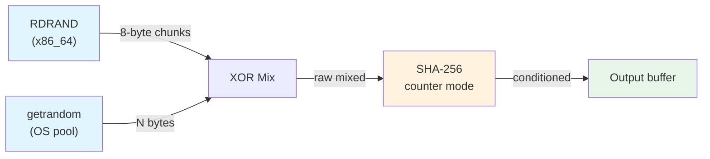
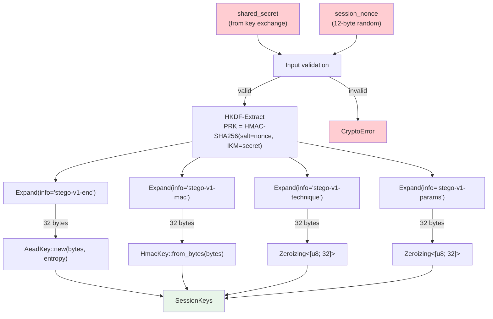
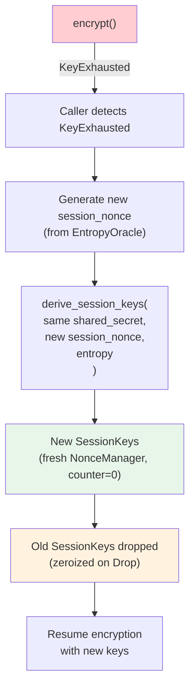

# Key Lifecycle — `stegosafe-crypto` (Phase 1)

> **Document version:** 1.0  
> **Crate version:** 0.1.0  
> **Last updated:** 2026-06-01  
> **Status:** Living document — update on every key-management change

---

## 1. Overview

This document describes the complete lifecycle of cryptographic key material
within `stegosafe-crypto`, from generation through zeroization.

```text
Generation → Derivation → Usage → Exhaustion → Zeroization
```

Every stage is designed to be **fail-closed** — errors propagate as typed
`CryptoError` variants, and no operation silently degrades security.

---

## 2. Key Generation (Entropy Sourcing)

### 2.1 `EntropyOracle` — The Single Source of Truth

All randomness in the system flows through [`EntropyOracle`](file:///d:/Stegosafe/crates/crypto/src/entropy.rs).
No module calls `getrandom`, `rand::thread_rng()`, or any other entropy API directly.

```rust
let entropy = EntropyOracle::init()?;
// All randomness requests go through this oracle
```

### 2.2 Source Hierarchy

| Priority | Source | Mechanism | Failure mode |
|---|---|---|---|
| 1 | Hardware TRNG | `rdrand` crate (x86_64 RDRAND instruction) | Falls back to OS-only |
| 2 | OS entropy pool | `getrandom` (`BCryptGenRandom` / `/dev/urandom`) | `EntropyUnavailable` error |
| 3 | Conditioning | SHA-256 counter mode over XOR of sources 1 & 2 | Never fails independently |

### 2.3 Health Checks

| Check | Trigger | Standard | Action on failure |
|---|---|---|---|
| TRNG stuck-at detection | `EntropyOracle::init()` | FIPS 140-3 (3 consecutive reads must differ) | Disable TRNG, use OS-only |
| Monobit test | Init + every 10,000 bytes | NIST SP 800-22 | Record in `EntropyHealth.last_check_passed` (fail-open) |
| OS pool availability | `EntropyOracle::init()` | N/A | If both TRNG and OS fail → `EntropyUnavailable` |

### 2.4 Entropy Flow Diagram



---

## 3. Key Derivation (HKDF-SHA-256)

### 3.1 `derive_session_keys` — The Derivation Entry Point

```rust
pub fn derive_session_keys(
    shared_secret: &[u8],      // From key exchange (Phase 5)
    session_nonce: &[u8; 12],  // 96-bit session-unique salt
    entropy: &EntropyOracle,   // For NonceManager initialisation
) -> Result<SessionKeys, CryptoError>
```

### 3.2 HKDF Parameters

| Parameter | Value | Purpose |
|---|---|---|
| Hash | SHA-256 | PRF for Extract and Expand |
| Salt | `session_nonce` (12 bytes) | Session uniqueness — different salt → different PRK |
| IKM | `shared_secret` (variable length) | Root key material from key exchange |
| Info | Domain-specific string (see below) | Cryptographic independence of derived keys |
| OKM length | 32 bytes per key | 256-bit keys for all derived materials |

### 3.3 Domain Separation

Each derived key uses a unique `info` string, ensuring that keys are
cryptographically independent — knowledge of one key reveals nothing about the others.

| Derived key | Info string | Type | Purpose |
|---|---|---|---|
| `enc_key` | `stego-v1-enc` | `AeadKey` | AES-256-GCM payload encryption |
| `mac_key` | `stego-v1-mac` | `HmacKey` | HMAC-SHA-256 cover image integrity |
| `technique_seed` | `stego-v1-technique` | `Zeroizing<[u8; 32]>` | Phase 3 technique selection RNG seed |
| `param_seed` | `stego-v1-params` | `Zeroizing<[u8; 32]>` | Phase 3 parameter randomisation seed |

### 3.4 Input Validation

| Condition | Error |
|---|---|
| `shared_secret` is empty | `CryptoError::InvalidInput("shared secret must not be empty")` |
| `session_nonce` is all zeros | `CryptoError::InvalidInput("session nonce must not be all zeros")` |
| HKDF expansion fails | `CryptoError::KdfError` |
| Entropy unavailable for NonceManager | `CryptoError::EntropyUnavailable` |

### 3.5 Derivation Flow



---

## 4. Key Usage

### 4.1 `AeadKey` — Authenticated Encryption

`AeadKey` wraps a 256-bit AES-GCM key with an integrated `NonceManager`.

#### Encryption

```rust
// encrypt(&self, plaintext: &[u8], aad: &[u8]) -> Result<Vec<u8>>
let ciphertext = keys.enc_key.encrypt(b"secret payload", b"session-ctx")?;
```

**Internal steps:**
1. **Compress** plaintext with Zstandard (level 3)
2. **Generate nonce** via `NonceManager::next()` (64-bit random base + 32-bit counter)
3. **Encrypt** compressed data with AES-256-GCM, binding `aad`
4. **Output** `nonce (12B) ‖ ciphertext (var) ‖ tag (16B)`

#### Decryption

```rust
// decrypt(&self, ciphertext: &[u8], aad: &[u8]) -> Result<Vec<u8>>
let plaintext = keys.enc_key.decrypt(&ciphertext, b"session-ctx")?;
```

**Internal steps:**
1. **Validate** minimum length (28 bytes: 12 nonce + 16 tag)
2. **Split** nonce from ciphertext+tag
3. **Decrypt** and verify tag with AES-256-GCM
4. **Decompress** Zstandard
5. **Return** plaintext only if tag is valid

#### Error Handling

| Error | Meaning | Design rationale |
|---|---|---|
| `CryptoError::KeyExhausted` | Nonce counter at `u32::MAX` | Forces rekey — prevents nonce reuse |
| `CryptoError::InvalidInput` | Ciphertext too short or compression failed | Safe to expose — no secret information |
| `CryptoError::DecryptionFailed` | Tag invalid, decompression failed, or any post-decrypt error | **Deliberately opaque** — prevents error oracle attacks |

### 4.2 `HmacKey` — Message Authentication

```rust
// Sign
let tag: [u8; 32] = keys.mac_key.sign(cover_image_bytes)?;

// Verify (constant-time)
keys.mac_key.verify(cover_image_bytes, &tag)?;
```

- `verify` uses `hmac::Mac::verify_slice` which performs constant-time comparison.
- Verification failure returns `CryptoError::DecryptionFailed` (same opaque error as AEAD).

### 4.3 Concurrency

`AeadKey` uses `Mutex<NonceManager>` internally, so `encrypt` takes `&self` (not `&mut self`).
Multiple threads can encrypt concurrently with the same key — the mutex serialises nonce generation only.

---

## 5. Key Exhaustion and Rekeying

### 5.1 The Exhaustion Boundary

```text
NonceManager counter:  0  →  1  →  2  →  ...  →  u32::MAX - 1  →  u32::MAX
                       ↑                              ↑                ↑
                     first                        last valid      KeyExhausted
                     nonce                          nonce            error
```

- **Maximum encryptions per key:** `u32::MAX` = 4,294,967,295 (≈ 4.29 billion)
- **At exhaustion:** `NonceManager::next()` returns `Err(CryptoError::KeyExhausted)`
- **The key is now dead.** No more encryptions are possible without rekeying.

### 5.2 Rekey Procedure



**Important:** The caller is responsible for detecting `KeyExhausted` and initiating rekey.
The crypto crate does not automatically rekey — that would require protocol-level coordination.

### 5.3 Counter Monitoring

```rust
// For diagnostics (not exposed publicly from AeadKey, but available on NonceManager)
let counter: u32 = nonce_manager.counter();
```

Callers should consider rekeying proactively well before `u32::MAX` (e.g., at 80% capacity = 3.4 billion operations) to avoid disrupting active transmissions.

---

## 6. Key Zeroization

### 6.1 Zeroization Mechanisms

| Material | Location | Mechanism | When |
|---|---|---|---|
| `AeadKey.key` | `Zeroizing<[u8; 32]>` | `zeroize` crate `Drop` impl | When `AeadKey` is dropped |
| `HmacKey.key` | `Zeroizing<[u8; 32]>` | `zeroize` crate `Drop` impl | When `HmacKey` is dropped |
| `SessionKeys.technique_seed` | `Zeroizing<[u8; 32]>` | `zeroize` crate `Drop` impl | When `SessionKeys` is dropped |
| `SessionKeys.param_seed` | `Zeroizing<[u8; 32]>` | `zeroize` crate `Drop` impl | When `SessionKeys` is dropped |
| `NonceManager.base` | `[u8; 8]` | Custom `Drop` impl calls `.zeroize()` | When `NonceManager` is dropped |
| `NonceManager.counter` | `u32` | Custom `Drop` impl sets to `0` | When `NonceManager` is dropped |
| Derivation intermediates | Stack `[u8; 32]` arrays | Explicit `.zeroize()` call | Immediately after use in `derive_session_keys` |

### 6.2 What the `zeroize` Crate Guarantees

- **Compiler-safe:** Uses `write_volatile` to prevent the compiler from optimising away the zeroing.
- **Single-pass:** Overwrites memory exactly once with zeros.
- **No heap remnants:** Stack arrays are zeroed in place; no copies are made.

### 6.3 Limitations

> [!WARNING]
> Zeroization does **not** protect against:
> - Memory that has been swapped to disk (use `mlock` at the OS level)
> - Core dumps that capture memory before drop (disable core dumps in production)
> - Speculative execution that may leave traces in CPU caches
> - `Vec<u8>` allocations that are reallocated by the allocator (old buffer not zeroed)

---

## 7. Session Lifecycle Diagram

```mermaid
sequenceDiagram
    participant App as Application
    participant EO as EntropyOracle
    participant KDF as derive_session_keys
    participant SK as SessionKeys
    participant AK as AeadKey
    participant NM as NonceManager

    Note over App: Session Start
    
    App->>EO: EntropyOracle::init()
    EO->>EO: Check TRNG (RDRAND)
    EO->>EO: Check OS pool (getrandom)
    EO->>EO: Run monobit test (1KB sample)
    EO-->>App: Ok(entropy)

    App->>KDF: derive_session_keys(secret, nonce, &entropy)
    KDF->>KDF: Validate inputs
    KDF->>KDF: HKDF-Extract(salt=nonce, IKM=secret)
    KDF->>KDF: HKDF-Expand(info="stego-v1-enc") → enc_bytes
    KDF->>KDF: HKDF-Expand(info="stego-v1-mac") → mac_bytes
    KDF->>KDF: HKDF-Expand(info="stego-v1-technique") → tech_seed
    KDF->>KDF: HKDF-Expand(info="stego-v1-params") → param_seed
    KDF->>AK: AeadKey::new(enc_bytes, &entropy)
    AK->>NM: NonceManager::new(&entropy)
    NM->>EO: entropy.fill(&mut base)
    EO-->>NM: 8 random bytes
    NM-->>AK: NonceManager { base, counter: 0 }
    KDF->>KDF: Zeroize intermediate buffers
    KDF-->>App: Ok(SessionKeys)

    Note over App: Message Exchange

    loop For each message
        App->>AK: encrypt(plaintext, aad)
        AK->>AK: Compress(plaintext)
        AK->>NM: next()
        NM->>NM: nonce = base ‖ counter++
        NM-->>AK: Ok([u8; 12])
        AK->>AK: AES-256-GCM encrypt
        AK-->>App: Ok(nonce ‖ ciphertext ‖ tag)
    end

    Note over App: Key Exhaustion (counter = u32::MAX)

    App->>AK: encrypt(plaintext, aad)
    AK->>NM: next()
    NM-->>AK: Err(KeyExhausted)
    AK-->>App: Err(KeyExhausted)
    
    Note over App: Rekey Required

    App->>App: Generate new session_nonce
    App->>KDF: derive_session_keys(secret, new_nonce, &entropy)
    KDF-->>App: Ok(new SessionKeys)

    Note over SK: Old SessionKeys dropped
    SK->>AK: Drop → Zeroizing clears key
    AK->>NM: Drop → zeroize base, counter=0
    SK->>SK: Drop → Zeroizing clears seeds

    Note over App: Session End (or process exit)
    App->>SK: Drop (goes out of scope)
    SK->>SK: All Zeroizing fields cleared
```

---

## 8. Security Invariants

The following invariants **must** hold at all times. Violation of any invariant
is a security bug.

| # | Invariant | Enforced by |
|---|---|---|
| 1 | No key material exists in memory after its owning struct is dropped | `Zeroizing` wrapper + custom `Drop` impls |
| 2 | No nonce is ever produced twice under the same key | `NonceManager` monotonic counter + `KeyExhausted` at `u32::MAX` |
| 3 | All tag comparisons are constant-time | `hmac::Mac::verify_slice`, `aes-gcm` internal `ConstantTimeEq` |
| 4 | Decryption errors are opaque | Single `DecryptionFailed` variant for all auth/decrypt/decompress failures |
| 5 | Derived keys are cryptographically independent | HKDF domain separation with unique `info` strings |
| 6 | All randomness comes from `EntropyOracle` | No other entropy API is called anywhere in the crate |
| 7 | No `unsafe` code exists in the crate | `#![forbid(unsafe_code)]` |
| 8 | No `.unwrap()` or `.expect()` in production code | `#![forbid(clippy::unwrap_used)]` |

---

## Appendix A: Key Type Quick Reference

```rust
// Construction
let entropy = EntropyOracle::init()?;
let keys = derive_session_keys(shared_secret, &session_nonce, &entropy)?;

// Encryption / Decryption
let ct = keys.enc_key.encrypt(plaintext, aad)?;
let pt = keys.enc_key.decrypt(&ct, aad)?;

// HMAC
let tag = keys.mac_key.sign(data)?;
keys.mac_key.verify(data, &tag)?;

// Seeds (for Phase 3)
let tech: &[u8; 32] = &keys.technique_seed;
let params: &[u8; 32] = &keys.param_seed;

// Health monitoring
let health: EntropyHealth = entropy.health();
assert!(health.last_check_passed);
```
